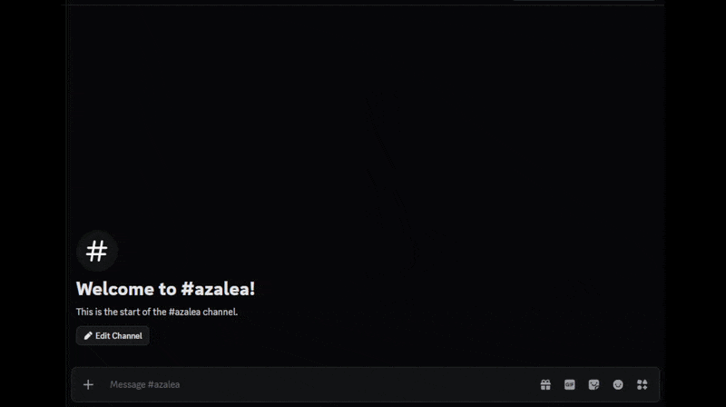

<div align="center">

<h3>Azalea</h3>
<p>Discord bot for X media: detects & reuploads links automatically</p>

<!-- <a href="https://deepwiki.com/yehezkieldio/azalea"></a> -->

<a href="https://github.com/yehezkieldio/azalea/releases"></a>
<a href="https://github.com/yehezkieldio/azalea/actions/workflows/ci.yml"></a>
<a href="https://github.com/yehezkieldio/azalea/pkgs/container/azalea"></a>

</div>

---

Azalea is a Discord bot that fetches X (formerly Twitter) media directly into your server. Submit a tweet URL via `/media`, and Azalea resolves the video or image, transcodes it if necessary to fit within Discord's upload limit, and posts it as a native attachment. No embeds, no redirects, no third-party viewers. Videos that still exceed the upload limit after transcoding are automatically split into sequential segments and posted in order.

> [!WARNING]
> Azalea downloads media from X via unofficial third-party services. This almost certainly violates X's Terms of Service. This project is intended for experimental and personal use only. See [LEGAL.md](LEGAL.md) for details.

<div align="center"></div>

## Features

- **Dual Resolver with Automatic Fallback**: Resolves media via the VxTwitter API first; falls back to yt-dlp automatically if that request fails or returns incomplete data. Maximizes reliability and compatibility with various X content and account types.
- **Size-Aware Transcoding**: Applies the cheapest viable strategy to bring a file under Discord's upload limit: pass-through, remux, transcode, or segment split. Re-encoding is performed only when strictly necessary. Performance-optimized presets balance speed and quality for typical X video content.
- **Hardware-Accelerated Encoding**: Offloads H.264 encoding to VAAPI (Intel/AMD iGPUs on Linux), NVENC (NVIDIA GPUs), or VideoToolbox (Apple Silicon and macOS) when available on the host / with a compatible FFmpeg build, with libx264 as a software fallback.
- **Persistent Deduplication**: Tracks processed media URLs across restarts using a Redb-backed cache. Identical requests within the configured TTL window are served immediately without re-downloading or re-transcoding.
- **Rate Limiting**: Per-user and per-channel sliding-window rate limits prevent abuse and protect Discord API quotas. Limits and window durations are configurable independently for users and channels.

## Pipeline

Each `/media` invocation runs through a fixed sequence of stages:

1. **Resolve**: The URL is submitted to the cached resolver chain. VxTwitter is tried first; yt-dlp is invoked as a fallback if that fails or returns incomplete metadata. Results are cached with a configurable TTL to avoid redundant outbound requests.
2. **Download**: The resolved media URL is SSRF-validated, checked against the allowlist, and streamed to a temporary file under a configured size cap. Disk space is verified before writing begins.
3. **Optimize**: A strategy ladder selects the cheapest path to meet Discord's upload limit: pass-through (already fits) → remux (container swap only) → transcode (re-encode with H.264) → segment split (sequential chunks). Hardware acceleration is applied at the transcode step when configured.
4. **Upload**: Prepared files are uploaded to Discord as native attachments. Segments are posted sequentially by default to preserve order, or can be batched into a single message. A progress message is updated during long operations and cleaned up on completion.
5. **Persistence**: Deduplication entries and pipeline metrics are flushed to Redb in background tasks. Temp files are removed by RAII guards regardless of outcome.

## Building from Source

Azalea currently does not have a public running instance or pre-built binaries. The recommended installation method is building from source or using the provided Docker images, this may change in the future. See below for instructions.

### Prerequisites

- [Rust](https://rustup.rs/) stable toolchain
- [`mold`](https://github.com/rui314/mold) linker — Linux only, can be disabled in `.cargo/config.toml`
- [`ffmpeg`](https://www.ffmpeg.org/) and [`ffprobe`](https://ffmpeg.org/ffprobe.html) on your `PATH` — used for probing, remuxing, and transcoding
- [`yt-dlp`](https://github.com/yt-dlp/yt-dlp) on your `PATH` — used as the fallback resolver

### Build

```sh
git clone https://github.com/yehezkieldio/azalea.git
cd azalea
cargo build --release -p azalea
```

The binary is placed at `./target/release/azalea`.

## Quick Start

### 1. Create a Discord application

1. Go to the [Discord Developer Portal](https://discord.com/developers/applications) and create a new application.
2. Under **Bot**, enable the bot and copy the token.
3. Under **OAuth2 → URL Generator**, select the `applications.commands` and `bot` scopes with the `Send Messages`, `Attach Files`, and `Manage Messages` permissions. Use the generated URL to invite the bot to your server.
4. Copy the **Application ID** from the General Information page.

### 2. Configure

Create `azalea.config.toml` in the directory you’ll run Azalea from:

```toml
application_id = 123456789012345678

[runtime]
worker_threads = 4

[concurrency]
download = 4
upload = 2
transcode = 1
pipeline = 8

[transcode]
quality_preset = "fast"        # fast | balanced | quality | size
hardware_acceleration = "none" # none | vaapi | nvenc | videotoolbox
max_upload_bytes = 8388608     # 8 MiB (Discord free tier default)

[pipeline]
user_rate_limit_requests = 10
user_rate_limit_window_secs = 60
channel_rate_limit_requests = 20
channel_rate_limit_window_secs = 60

[storage]
dedup_persistent = true
dedup_ttl_hours = 24
```

Provide the bot token via environment variable (or a `.env` file):

```sh
DISCORD_TOKEN=your_bot_token_here
```

### 3. Run

```sh
./target/release/azalea
```

Azalea registers slash commands on startup and begins accepting interactions immediately.

## Docker

Docker images are published to the GitHub Container Registry. The published tags are Linux-only (`linux/amd64`), and are split by runtime capability.

| Tag      | Description                                                 |
| -------- | ----------------------------------------------------------- |
| `latest` | Software encoding only (libx264). Compatible with any host. |
| `vaapi`  | VAAPI hardware acceleration for Intel/AMD iGPUs on Linux.   |

To build locally from the Dockerfile:

```sh
docker build --target runtime-cpu -t azalea:cpu .
docker build --target runtime-vaapi -t azalea:vaapi .
```

### Software (CPU)

```sh
docker run -d \
  -e DISCORD_TOKEN=your_token \
  -e APPLICATION_ID=your_app_id \
  ghcr.io/yehezkieldio/azalea:latest
```

### VAAPI (Intel/AMD iGPU)

```sh
docker run -d \
  --device /dev/dri/renderD128:/dev/dri/renderD128 \
  -e DISCORD_TOKEN=your_token \
  -e APPLICATION_ID=your_app_id \
  -e AZALEA_HARDWARE_ACCELERATION=vaapi \
  -e AZALEA_VAAPI_DEVICE=/dev/dri/renderD128 \
  ghcr.io/yehezkieldio/azalea:vaapi
```

Notes:
- If you get permission errors on `/dev/dri/renderD128`, add `--group-add render --group-add video` (group names can vary by distro).
- If VAAPI fails to initialize, verify the host supports it (e.g., `vainfo`) and that the correct VA drivers are installed.

### NVENC (NVIDIA GPU)

Using NVIDIA acceleration requires three things:

1. Linux host with an NVIDIA GPU and NVENC-capable driver.
2. GPU passthrough: install [NVIDIA Container Toolkit](https://docs.nvidia.com/datacenter/cloud-native/container-toolkit/latest/install-guide.html) on the host and run with `--gpus all`.
3. An FFmpeg build compiled with NVENC/NVDEC support. GPU passthrough alone does not enable NVENC in a CPU-only FFmpeg binary.

Azalea’s `latest` image is CPU-only. To enable NVENC:

#### Bring Your Own FFmpeg

Mount an NVENC-enabled `ffmpeg`/`ffprobe` into the container and set the paths:

```sh
docker run -d \
  --gpus all \
  -v /usr/local/bin/ffmpeg:/opt/ffmpeg/ffmpeg:ro \
  -v /usr/local/bin/ffprobe:/opt/ffmpeg/ffprobe:ro \
  -e DISCORD_TOKEN=your_token \
  -e APPLICATION_ID=your_app_id \
  -e AZALEA_HARDWARE_ACCELERATION=nvenc \
  -e AZALEA_FFMPEG_PATH=/opt/ffmpeg/ffmpeg \
  -e AZALEA_FFPROBE_PATH=/opt/ffmpeg/ffprobe \
  ghcr.io/yehezkieldio/azalea:latest
```

> Ensure your FFmpeg build is NVENC-enabled. Prebuilt binaries or custom compilation may be required.

### VideoToolbox (macOS)

VideoToolbox is macOS-only. Run Azalea natively on macOS to leverage Apple hardware acceleration and use the `videotoolbox` config option.

## Configuration

By default, Azalea only requires `APPLICATION_ID` and `DISCORD_TOKEN` to run, with sensible defaults for all other settings.

Configuration is loaded from three sources in ascending priority order:

1. `azalea.config.toml`
2. `.env` file
3. Process environment variables

`DISCORD_TOKEN` must always be provided via environment or `.env`.
Most environment variables use the `AZALEA_` prefix (e.g., `AZALEA_HARDWARE_ACCELERATION`, `AZALEA_MAX_UPLOAD_BYTES`); exceptions are `APPLICATION_ID` and `DISCORD_TOKEN`.

Selected environment variables:

| Variable                                   | Config path                               | Default               |
| ------------------------------------------ | ----------------------------------------- | --------------------- |
| `DISCORD_TOKEN`                            | — (env/`.env` only)                       | required              |
| `APPLICATION_ID` / `AZALEA_APPLICATION_ID` | `application_id`                          | required              |
| `AZALEA_HARDWARE_ACCELERATION`             | `transcode.hardware_acceleration`         | `none`                |
| `AZALEA_MAX_UPLOAD_BYTES`                  | `transcode.max_upload_bytes`              | `8388608`             |
| `AZALEA_QUALITY_PRESET`                    | `transcode.quality_preset`                | `fast`                |
| `AZALEA_VAAPI_DEVICE`                      | `transcode.vaapi_device`                  | `/dev/dri/renderD128` |
| `AZALEA_TEMP_DIR`                          | `storage.temp_dir`                        | `/tmp/azalea`         |
| `AZALEA_DEDUP_PERSISTENT`                  | `storage.dedup_persistent`                | `true`                |
| `AZALEA_DEDUP_TTL_HOURS`                   | `storage.dedup_ttl_hours`                 | `24`                  |
| `AZALEA_USER_RATE_LIMIT_REQUESTS`          | `pipeline.user_rate_limit_requests`       | `10`                  |
| `AZALEA_USER_RATE_LIMIT_WINDOW_SECS`       | `pipeline.user_rate_limit_window_secs`    | `60`                  |
| `AZALEA_CHANNEL_RATE_LIMIT_REQUESTS`       | `pipeline.channel_rate_limit_requests`    | `20`                  |
| `AZALEA_CHANNEL_RATE_LIMIT_WINDOW_SECS`    | `pipeline.channel_rate_limit_window_secs` | `60`                  |
| `AZALEA_FFMPEG` / `AZALEA_FFMPEG_PATH`     | `binaries.ffmpeg`                         | `ffmpeg`              |
| `AZALEA_FFPROBE` / `AZALEA_FFPROBE_PATH`   | `binaries.ffprobe`                        | `ffprobe`             |
| `AZALEA_YTDLP_PATH`                        | `binaries.ytdlp`                          | `yt-dlp`              |

The full list of environment variables is documented in `azalea.config.toml`.

## Operations and Observability

- **Deduplication**: Processed media URLs are stored in `azalea-dedup.redb`. Requests for the same URL within the TTL window are resolved immediately without re-downloading. The store is flushed to disk periodically and survives restarts when `dedup_persistent = true`.
- **Metrics**: Pipeline metrics are persisted to `azalea-metrics.redb` and flushed in a background task.
- **Temp files**: All temporary files are managed by RAII guards and removed on completion or failure, including on panics.
- **Session resume**: Gateway session state is written to `azalea-resume-info.json` on shutdown and used to resume the WebSocket session on restart, reducing reconnect latency.
- **Logging**: Log output is controlled by `RUST_LOG`.


### JSON Schema

A JSON Schema is available for editor autocompletion and inline docs:

With [Taplo](https://taplo.tamasfe.dev/configuration/directives.html#the-schema-directive):

```toml
#:schema https://raw.githubusercontent.com/yehezkieldio/azalea/refs/heads/master/azalea.schema.json
```

To generate the schema locally:

```sh
cargo run --features schemars --bin generate-schema
```

Generate a sample config with defaults:

```sh
cargo run -p azalea --bin generate-config
```

## Hardware Acceleration

Hardware acceleration offloads H.264 encoding to a dedicated hardware encoder via FFmpeg.
Only transcode steps are affected; pass-through or remux paths remain CPU-bound.

| Backend      | Config value   | Where it works                                                          | Status             |
| ------------ | -------------- | ----------------------------------------------------------------------- | ------------------ |
| Software     | `none`         | Any CPU (default, most compatible).                                     | Tested             |
| VAAPI        | `vaapi`        | Linux + Intel/AMD iGPU with `/dev/dri/renderD128`.                      | Tested             |
| NVENC        | `nvenc`        | Linux + NVIDIA GPU with NVENC-enabled FFmpeg. Requires GPU passthrough. | Untested, see note |
| VideoToolbox | `videotoolbox` | macOS only (Apple Silicon or Intel).                                    | Untested, see note |

> NVENC and VideoToolbox support is implemented based on FFmpeg documentation and standard integration patterns, but has not been verified against real hardware. The code paths exist and should work in principle, but may require adjustments. Reports and fixes from users with access to this hardware are welcome.

Example config:

```toml
[transcode]
hardware_acceleration = "vaapi"
vaapi_device = "/dev/dri/renderD128"
```

Or via environment:

```sh
AZALEA_HARDWARE_ACCELERATION=vaapi
AZALEA_VAAPI_DEVICE=/dev/dri/renderD128
```

## Development

Requires [`just`](https://just.systems/) and [`cargo-nextest`](https://nexte.st/).

```sh
just check            # compilation check
just clippy           # lint with -D warnings
just test             # run all tests via nextest
just fmt              # format code
just fmt-check        # check formatting without applying
just run              # run bot locally
just generate-schema  # generate JSON schema for config
just generate-config  # generate default config file
just all              # fmt + clippy + test
```

## License

Licensed under either the MIT License or the Apache License 2.0, at your option.

See [LICENSE-MIT](LICENSE-MIT) and [LICENSE-APACHE](LICENSE-APACHE) for details.
